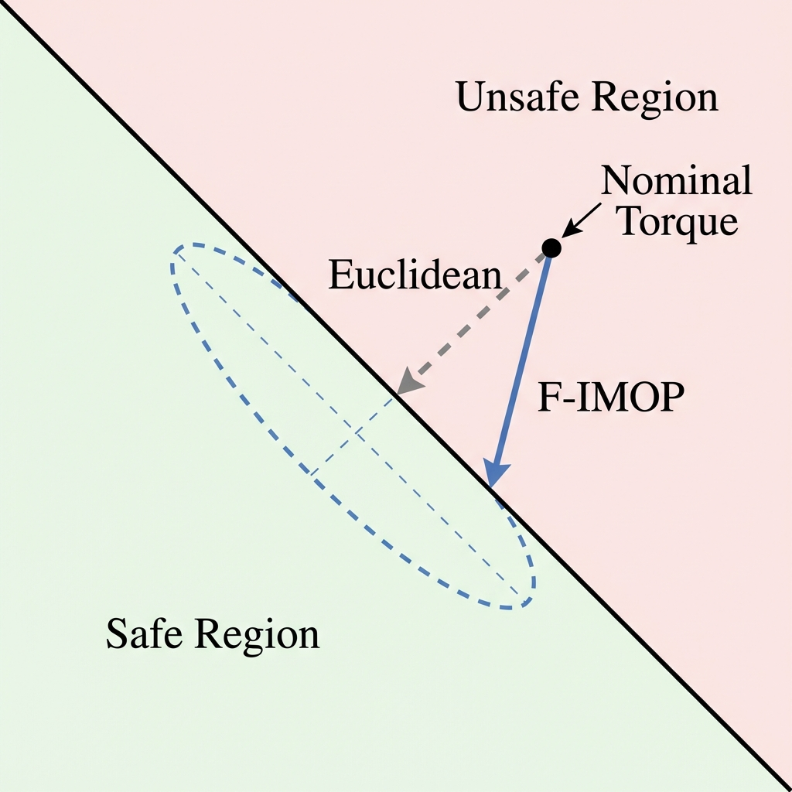
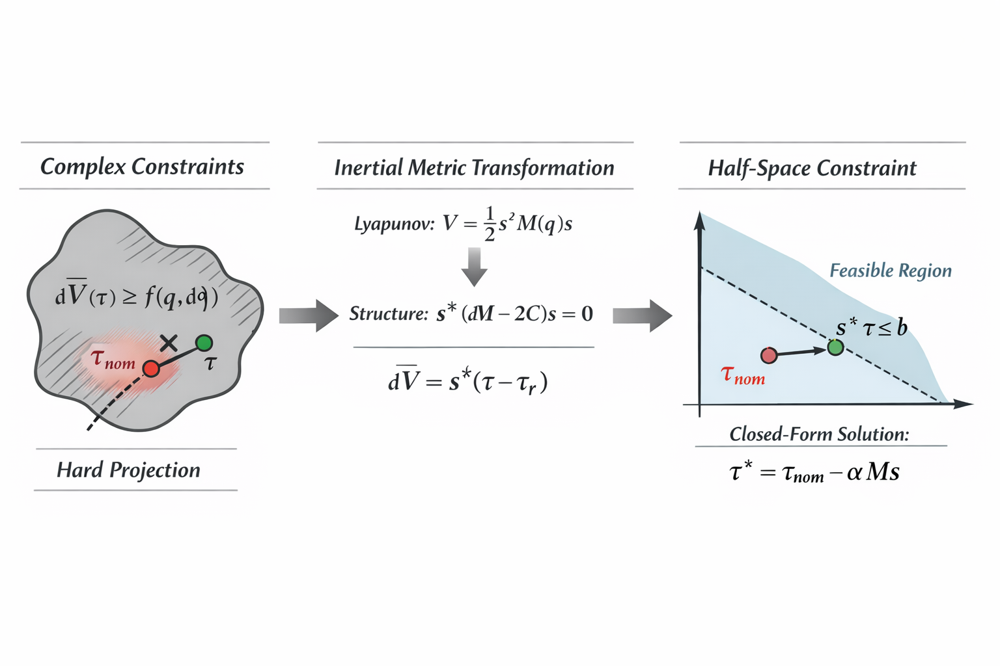
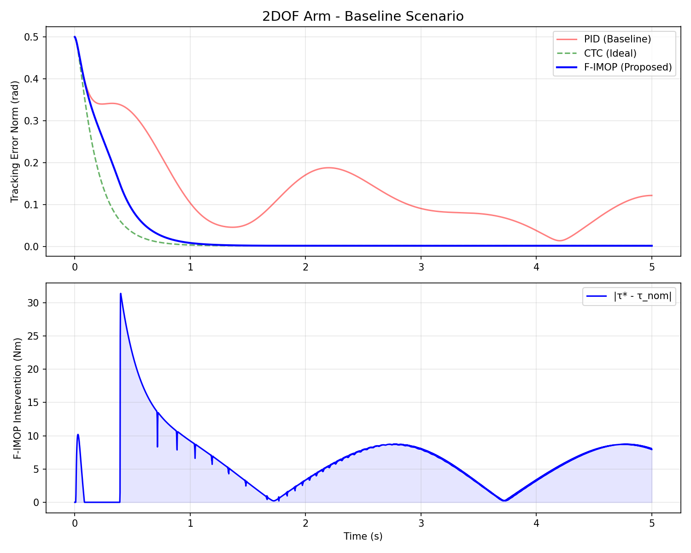

<div align="center">

# F-IMOP

**Filtered-Error Inertia-Metric Optimal Projection for Safe Robot Control**

[English](#english) | [中文](#chinese-中文)

[](https://opensource.org/licenses/MIT)
[](https://www.python.org/downloads/)
[]()

<br/>



</div>

---

<br/>

<a id="english"></a>

## 🚀 Overview

**F-IMOP** is a lightweight, plug-and-play safety filter designed for robotic systems. It acts as a "guardian" layer that sits between any nominal controller (such as a neural network policy or a PID controller) and the robot hardware.

By projecting control inputs onto a safe set defined by the **inertia metric**, F-IMOP guarantees **Global Exponential Stability** for trajectory tracking tasks, even in the presence of model uncertainties and external disturbances.

### ✨ Key Features

- **🛡️ Safety Guarantee**: Rigorous Lyapunov-based proof for exponential convergence.
- **⚡ High Performance**: Closed-form solution (no iterative QP solver needed), capable of >1kHz control loops.
- **🧩 Universal Interface**: Compatible with any nominal controller and robot dynamics.
- 🤖 **URDF Support**: Load any robot model directly using `URDFModel` (via Pinocchio).
- **🔧 Robustness**: Demonstrated stability with up to 30% parameter mismatch.

---

## 📐 Methodology

The core innovation of F-IMOP is projecting the nominal control input $\tau_{nom}$ onto a stabilizing subspace using the robot's inertia matrix $M(q)$ as the Riemannian metric. This specific metric choice geometrically cancels out nonlinear system dynamics constraints.

<div align="center">

<p><i>Figure: Geometric interpretation of the inertia-metric projection in the control space.</i></p>
</div>

The optimization problem is formulated as:

$$
\tau^* = \arg\min_{\tau} \frac{1}{2} (\tau - \tau_{nom})^\top M^{-1} (\tau - \tau_{nom})
$$

Subject to the stability constraint:

$$
s^\top \tau \le s^\top \tau_{ref} - \frac{\lambda}{2} s^\top M s
$$

> 📚 **[查看完整理论推导 / Full Theory & Derivations →](docs/THEORY.md)**

---

## 📦 Installation

```bash
git clone https://github.com/Hxxxz0/F-IMOP.git
cd fimop
pip install -e .
```

## 💻 Quick Start

### Example 1: Basic Usage ([`examples/basic_usage.py`](examples/basic_usage.py))

```python
from fimop import FIMOPController
from fimop.dynamics import TwoLinkArm

# 1. Create robot model
robot = TwoLinkArm()

# 2. Initialize F-IMOP safety filter
controller = FIMOPController(robot, Lambda=5.0, decay_rate=2.0)

# 3. In control loop: filter any nominal torque
tau_safe, info = controller.compute_safe_control(
    q, dq, q_target, dq_target, ddq_target, tau_nominal
)
print(f"Constraint active: {info['active']}, Correction: {info['correction']:.2f} Nm")
```

```bash
python examples/basic_usage.py
```

### Example 2: URDF Robot Model ([`examples/urdf_test.py`](examples/urdf_test.py))

Load any robot from a standard URDF file using [Pinocchio](https://github.com/stack-of-tasks/pinocchio):

```bash
pip install pin  # Install Pinocchio
```

```python
from fimop.dynamics import URDFModel

robot = URDFModel("path/to/robot.urdf")
controller = FIMOPController(robot, Lambda=10.0)
```

```bash
python examples/urdf_test.py  # Runs simulation with visualization
```

### Example 3: Paper Experiments ([`examples/paper_experiments.py`](examples/paper_experiments.py))

Reproduce all experiments from the paper (Baseline, Disturbance, Mismatch):

```bash
python examples/paper_experiments.py
# Generates 6 comparison plots in results/
```

---

## 📊 Experiments & Results

We validated F-IMOP on 2-DOF and 6-DOF manipulators. The algorithm demonstrates superior tracking accuracy and robustness compared to standard PID and CTC methods, especially under model mismatch.

<div align="center">

<p><i>Result: F-IMOP achieves near-perfect tracking accuracy (blue line) overlapping with ideal CTC, while maintaining minimal intervention.</i></p>
</div>

To reproduce these results:
```bash
python examples/paper_experiments.py
```

---
<br/><br/>

<a id="chinese-中文"></a>

# F-IMOP (中文介绍)

**基于惯性度量的滤波误差最小扰动投影安全控制框架**

[English](#english) | [中文](#chinese-中文)

## 📖 简介

**F-IMOP** 是一个专为机器人系统设计的轻量级安全过滤层。它可以“包裹”任意名义控制器（如深度强化学习策略、PID等），通过实时修正控制指令，强制保障机器人在轨迹跟踪任务中的物理稳定性。

不同于传统的控制屏障函数（CBF），F-IMOP 利用机器人的**惯性矩阵**作为度量空间进行最优投影，从而获得了无需数值迭代的显式闭值解，能够轻松在千赫兹（kHz）频率下运行。

### ✨ 核心特性

- **🛡️ 理论安全**: 基于 Lyapunov 理论提供严格的全局指数稳定性（GES）证明。
- **⚡ 极速计算**: 闭式解算法，计算开销极低，适合嵌入式部署。
- **🧩 通用接口**: 只要提供动力学方程，即可适配任何串联机械臂。
- **🤖 URDF 支持**: 原生支持通过 Pinocchio 加载 URDF 模型文件。
- **🔧 强鲁棒性**: 在 30% 模型参数误差及外部强扰动下仍能保持稳定。

---

## 📐 方法原理

F-IMOP 的核心思想是在控制空间中求解一个带约束的二次规划（QP）问题。我们发现，如果使用惯性矩阵 $M(q)$ 的逆作为距离度量，原本复杂的非线性动力学约束会瞬间简化为线性约束。

<div align="center">

</div>

优化目标是在满足稳定性约束的前提下，最小化对名义控制 $\tau_{nom}$ 的修改量：

$$
\tau^* = \arg\min_{\tau} \frac{1}{2} (\tau - \tau_{nom})^\top M^{-1} (\tau - \tau_{nom})
$$

$$
\text{s.t.} \quad s^\top \tau \le s^\top \tau_{ref} - \frac{\lambda}{2} s^\top M s
$$

> 📚 **[完整理论推导与直觉解释 →](docs/THEORY.md)**

---

## 📦 安装说明

```bash
git clone https://github.com/Hxxxz0/F-IMOP.git
cd fimop
pip install -e .
```

## 💻 快速开始

### 示例 1：基础用法 ([`examples/basic_usage.py`](examples/basic_usage.py))

```python
from fimop import FIMOPController
from fimop.dynamics import TwoLinkArm

# 1. 创建机器人模型
robot = TwoLinkArm()

# 2. 初始化 F-IMOP 安全过滤器
controller = FIMOPController(robot, Lambda=5.0, decay_rate=2.0)

# 3. 在控制循环中过滤任意名义力矩
tau_safe, info = controller.compute_safe_control(
    q, dq, q_target, dq_target, ddq_target, tau_nominal
)
print(f"约束激活: {info['active']}, 修正量: {info['correction']:.2f} Nm")
```

```bash
python examples/basic_usage.py
```

### 示例 2：URDF 模型 ([`examples/urdf_test.py`](examples/urdf_test.py))

通过 [Pinocchio](https://github.com/stack-of-tasks/pinocchio) 加载任意 URDF 机器人：

```bash
pip install pin  # 安装 Pinocchio
```

```python
from fimop.dynamics import URDFModel

robot = URDFModel("path/to/robot.urdf")
controller = FIMOPController(robot, Lambda=10.0)
```

```bash
python examples/urdf_test.py  # 运行仿真并生成可视化
```

### 示例 3：论文实验 ([`examples/paper_experiments.py`](examples/paper_experiments.py))

复现论文所有实验（基准、抗扰、模型失配）：

```bash
python examples/paper_experiments.py
# 在 results/ 目录生成 6 张对比图
```

---

## 📊 实验结果

我们在 2自由度 和 6自由度 机械臂上进行了广泛测试。结果表明，F-IMOP 在模型极其不准确（30% 误差）的情况下，依然能实现接近理想计算力矩控制（CTC）的精度。

<div align="center">

<p><i>实验结果：在基准测试中，F-IMOP (蓝线) 展现了近乎完美的跟踪精度，且仅在必要时介入（下方阴影区域）。</i></p>
</div>

复现实验：
```bash
python examples/paper_experiments.py
```

---

## 🗺️ Roadmap / 开发计划

We are actively developing F-IMOP. Here's what's coming:

| Status | Feature | Description |
|--------|---------|-------------|
| ✅ Done | NumPy Backend | Pure NumPy implementation, no dependencies |
| ✅ Done | URDF Support | Load any robot via Pinocchio |
| 🔜 Planned | **PyTorch Backend** | GPU acceleration & differentiable safety filter |
| 🔜 Planned | **JAX Backend** | JIT compilation for real-time performance |
| 🔜 Planned | **CBF Integration** | Combine with Control Barrier Functions for obstacle avoidance |
| 🔜 Planned | **ROS2 Node** | Ready-to-use ROS2 package |
| 💡 Future | **IsaacGym Integration** | Parallel simulation for RL training |
| 💡 Future | **MuJoCo Support** | Native MuJoCo dynamics interface |

> 💬 **Contributions welcome!** Feel free to open issues or PRs.

---

## 📄 Citation

If you find this work useful, please cite:

```bibtex
@misc{jia2026fimop,
  title={F-IMOP: Filtered-Error Inertia-Metric Optimal Projection for Safe Robot Control},
  author={Jia, Haozhe},
  year={2026},
  howpublished={\url{https://github.com/Hxxxz0/F-IMOP}}
}
```

<div align="center">
<sub>Built with ❤️ by Haozhe Jia</sub>
</div>
